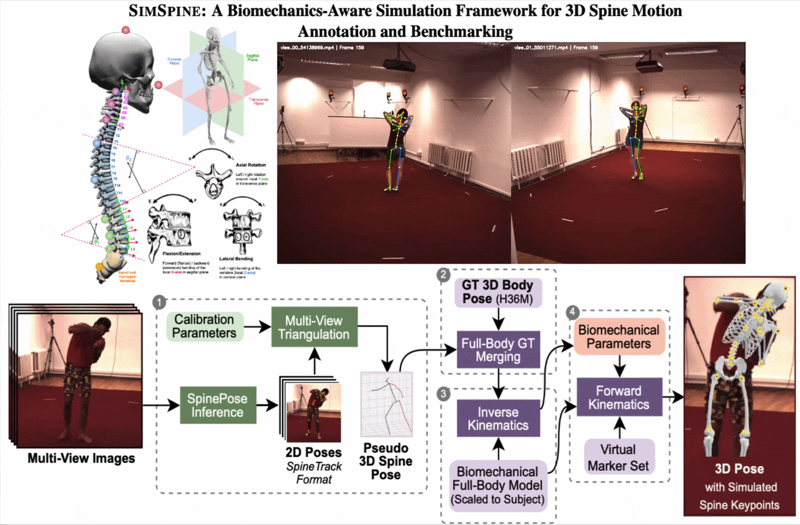

# SIMSPINE: A Biomechanics-Aware Simulation Framework for 3D Spine Motion Annotation and Benchmarking

<div align="center">

[](https://saifkhichi.com/research/simspine/)
[](https://arxiv.org/pdf/2602.20792)
[](https://arxiv.org/abs/2602.20792)
[](https://huggingface.co/datasets/dfki-av/simspine)
[](https://github.com/dfki-av/spinepose)


</div>

---

> __Abstract__: _Modeling spinal motion is fundamental to understanding human biomechanics, yet remains underexplored in computer vision due to the spine's complex multi-joint kinematics and the lack of large-scale 3D annotations. We present a biomechanics-aware keypoint simulation framework that augments existing human pose datasets with anatomically consistent 3D spinal keypoints derived from musculoskeletal modeling. Using this framework, we create the first open dataset, named SIMSPINE, which provides sparse vertebra-level 3D spinal annotations for natural full-body motions in indoor multi-camera capture without external restraints. With 2.14 million frames, this enables data-driven learning of vertebral kinematics from subtle posture variations and bridges the gap between musculoskeletal simulation and computer vision. In addition, we release pretrained baselines covering fine-tuned 2D detectors, monocular 3D pose lifting models, and multi-view reconstruction pipelines, establishing a unified benchmark for biomechanically valid spine motion estimation. Specifically, our 2D spine baselines improve the state-of-the-art from 0.63 to 0.80 AUC in controlled environments, and from 0.91 to 0.93 AP for in-the-wild spine tracking. Together, the simulation framework and SIMSPINE dataset advance research in vision-based biomechanics, motion analysis, and digital human modeling by enabling reproducible, anatomically grounded 3D spine estimation under natural conditions._

## Overview

Official repository for the CVPR 2026 paper "SIMSPINE: A Biomechanics-Aware Simulation Framework for 3D Spine Motion Annotation and Benchmarking" by Muhammad Saif Ullah Khan and Didier Stricker.

- [Simulation Framework](#simspine-simulation-framework)
- [SIMSPINE Dataset](#simspine-benchmark-dataset)
- [Benchmark Results](#benchmark-results)
- [Limitations and Intended Use](#limitations-and-intended-use)
- [Licensing](#licensing)
- [Citation](#citation)
- [Acknowledgement](#acknowledgement)
- [Release Roadmap](#release-roadmap)

### Release Notes

- **2026-03-24**: Released the SIMSPINE [simulation framework](./src/simspine/data_generation), added end-to-end dataset build script `scripts/create_dataset.sh`, and released the SIMSPINE dataset on [HuggingFace](https://huggingface.co/datasets/dfki-av/simspine)
- **2026-03-23**: SpinePose-SIMSPINE ONNX models for 2D pose estimation released via the [SpinePose inference library](https://github.com/dfki-av/spinepose) in [v2.0.1](https://github.com/dfki-av/spinepose/tree/v2.0.1)
- **2026-03-10**: Release PyTorch checkpoints for 2D (SpinePose, ViTPose, HRNet) and 2D-to-3D lifting baselines

## Simulation Framework

SIMSPINE framework provides an end-to-end data-generation pipeline that creates spine-augmented annotations from Human3.6M markers and predicted spine pseudo-markers.

The framework in `src/simspine/data_generation/` follows six steps:
1. Merge predicted pseudo-markers* with known Human3.6M body markers (`1_merge_predictions.py`).
2. Create subject-scaled OpenSim models (`2_scale_model.py`).
3. Run inverse kinematics to generate motion trajectories (`3_kinematics.py`).
4. Convert simulated OpenSim marker outputs (`.sto`) to TRC (`4_simulate_markers.py`).
5. Merge simulated spine/body markers into unified trajectories (`5_merge_simulation.py`).
6. Apply temporal Butterworth filtering for smooth final markers (`6_filtering.py`).

> [!NOTE]
> *Predicted markers are generated using [Pose2Sim](https://github.com/perfanalytics/pose2sim) - further details to be released in a future update.

Run the full pipeline with:

```bash
bash scripts/create_dataset.sh
```

Expected directories:
- Human3.6M processed inputs: `data/h36m/processed/annotations/<Subject>/`
- Predicted pseudo-markers: `data/simspine_scratch/0_Predicted/<Subject>/`
- Final marker outputs: `data/simspine/markers/<Subject>/`
- Kinematics outputs: `data/simspine/kinematics/<Subject>/`
- Subject models: `data/simspine/models/<Subject>.osim`

## Benchmark Dataset

SIMSPINE dataset adds 3D spine keypoint annotations to Human3.6M. It augments Human3.6M with spine-aware labels using a biomechanics-aware pipeline that combines multi-view spinal detection, robust triangulation, marker merging, subject-scaled OpenSim inverse kinematics, and virtual vertebral markers.

The resulting benchmark contains 2.14M frames from 7 subjects across 15 actions, and provides 15 spine-centric keypoints together with vertebral rotational parameters.

Important scope note:
- SIMSPINE does not redistribute original Human3.6M images, videos, mocap data, or original Human3.6M joint annotations.
- It provides additional annotations aligned to Human3.6M frames.
- Users must obtain Human3.6M independently: https://vision.imar.ro/human3.6m/

Supported tasks include:
- 2D human pose estimation
- 3D human pose estimation
- spine pose estimation
- human motion analysis
- biomechanics-aware modeling
- 2D-to-3D pose lifting
- spine reconstruction benchmarking

More details can be found in the [dataset documentation](./docs/dataset.md).

## Benchmark Results

### Key Results

| Task | Setting | Result |
|---|---|---|
| 2D pose estimation | Best indoor result on SIMSPINE | **0.803 AUC** (SpinePose-l-ft) |
| 2D pose estimation | Best outdoor spine tracking on SpineTrack | **0.928 AP^S / 0.937 AR^S** (SpinePose-m-ft) |
| Multi-view 3D reconstruction | Fine-tuned 2D detections | **31.82 mm MPJPE** and **29.53 mm P-MPJPE** (full skeleton) |
| Multi-view 3D reconstruction | Oracle setting with GT 2D | **7.85 mm MPJPE** and **1.79 mm P-MPJPE** (full skeleton) |
| Monocular 3D lifting | Detected 2D, full-body training | **16.28 mm P-MPJPE** (spine joints) |
| Monocular 3D lifting | GT 2D, full-body training | **13.48 mm P-MPJPE** and **25.94 mm MPJPE** (spine joints) |

### 2D spine keypoint estimation from RGB

| Method | Pretrain | Finetune | AP^B | AR^B | AP^S | AR^S | AUC | Model Links |
|---|---|---|---:|---:|---:|---:|---:|---|
| SpinePose-s | SpineTrack | - | 0.792 | 0.821 | 0.896 | 0.908 | 0.611 | [PyTorch](https://huggingface.co/dfki-av/spinepose/resolve/main/spinetrack/pytorch/spinepose-s_32xb256-10e_spinetrack-256x192.pth) · [ONNX](https://huggingface.co/dfki-av/spinepose/resolve/main/spinepose-s_32xb256-10e_spinetrack-256x192.onnx) |
| SpinePose-m | SpineTrack | - | 0.840 | 0.864 | 0.914 | 0.926 | 0.633 | [PyTorch](https://huggingface.co/dfki-av/spinepose/resolve/main/spinetrack/pytorch/spinepose-m_32xb256-10e_spinetrack-256x192.pth) · [ONNX](https://huggingface.co/dfki-av/spinepose/resolve/main/spinepose-m_32xb256-10e_spinetrack-256x192.onnx) |
| SpinePose-l | SpineTrack | - | **0.854** | **0.877** | 0.910 | 0.922 | 0.633 | [PyTorch](https://huggingface.co/dfki-av/spinepose/resolve/main/spinetrack/pytorch/spinepose-l_32xb256-10e_spinetrack-256x192.pth) · [ONNX](https://huggingface.co/dfki-av/spinepose/resolve/main/spinepose-l_32xb256-10e_spinetrack-256x192.onnx) |
| SpinePose-s-ft | SpineTrack | SIMSPINE | 0.788 | 0.815 | 0.920 | 0.929 | 0.790 | [PyTorch](https://huggingface.co/dfki-av/spinepose/resolve/main/simspine/2d/pytorch/spinepose-s_32xb256-10e_simspine-256x192.pth) · [ONNX](https://huggingface.co/dfki-av/spinepose/resolve/main/spinepose-s_32xb256-10e_simspine-256x192.onnx) |
| SpinePose-m-ft | SpineTrack | SIMSPINE | 0.821 | 0.846 | **0.928** | **0.937** | 0.798 | [PyTorch](https://huggingface.co/dfki-av/spinepose/resolve/main/simspine/2d/pytorch/spinepose-m_32xb256-10e_simspine-256x192.pth) · [ONNX](https://huggingface.co/dfki-av/spinepose/resolve/main/spinepose-m_32xb256-10e_simspine-256x192.onnx) |
| SpinePose-l-ft | SpineTrack | SIMSPINE | 0.840 | 0.862 | 0.917 | 0.927 | **0.803** | [PyTorch](https://huggingface.co/dfki-av/spinepose/resolve/main/simspine/2d/pytorch/spinepose-l_32xb256-10e_simspine-256x192.pth) · [ONNX](https://huggingface.co/dfki-av/spinepose/resolve/main/spinepose-l_32xb256-10e_simspine-256x192.onnx) |
| HRNet-w32 | COCO | SIMSPINE | 0.776 | 0.806 | 0.905 | 0.918 | 0.769 | [PyTorch](https://huggingface.co/dfki-av/spinepose/resolve/main/simspine/2d/pytorch/td-hm_hrnet-w32_8xb64-10e_simspine-256x192.pth) · ONNX |
| RTMPose-m | COCO | SIMSPINE | 0.832 | 0.858 | 0.925 | 0.935 | 0.794 | PyTorch · ONNX |
| ViTPose-b | COCO | SIMSPINE | 0.835 | 0.866 | 0.921 | 0.933 | 0.794 | [PyTorch](https://huggingface.co/dfki-av/spinepose/resolve/main/simspine/2d/pytorch/td-hm_ViTPose-base_8xb64-10e_simspine-256x192.pth) · ONNX |


### Multi-view 3D spine reconstruction

- Fine-tuned multi-view triangulation reaches 31.82 mm MPJPE and 29.53 mm P-MPJPE
- Oracle setting with GT 2D reaches 7.85 mm MPJPE and 1.79 mm P-MPJPE
- Fine-tuning 2D detector quality reduces full-skeleton MPJPE from 49.30 mm to 31.82 mm

### Monocular 2D-to-3D lifting

- Full-body monocular lifting outperforms spine-only lifting, reaching 16.28 mm P-MPJPE with detected 2D input
- With GT 2D input, full-body lifting reaches 13.48 mm P-MPJPE and 25.94 mm MPJPE on spine joints
- Ablation takeaway: using only 2% of SIMSPINE (~31k indoor images) already provides near-saturated 2D performance

## Limitations and Intended Use

- The benchmark is simulation-derived and should be treated as a scalable proxy for method development, not direct clinical measurement.
- The lumbar spine is detailed, while thoracic and cervical regions are simplified for identifiability from RGB.
- Intervertebral translations, rib-cage coupling, and force-consistent dynamics are not modeled.
- The visual domain comes from Human3.6M, so appearance diversity and pathology coverage are limited.
- Recommended use: pretraining, benchmarking, and controlled development before fine-tuning on smaller biomechanically validated datasets.

## Licensing

SIMSPINE is released under the [SIMSPINE Academic Research License](LICENSE).

Key conditions:
- Academic research use only
- No redistribution of the dataset
- Proper citation required

SIMSPINE is a derived dataset from Human3.6M. Users must also comply with the Human3.6M license agreement: https://vision.imar.ro/human3.6m/

Out-of-scope uses:
- clinical diagnosis
- medical decision making
- commercial products without permission

## Citation

If you use SIMSPINE, please cite:

```bibtex
@inproceedings{khan2026simspine,
  author = {Khan, Muhammad Saif Ullah and Stricker, Didier},
  title = {SIMSPINE: A Biomechanics-Aware Simulation Framework for 3D Spine Motion Annotation and Benchmarking},
  booktitle = {Proceedings of the IEEE/CVF Conference on Computer Vision and Pattern Recognition (CVPR)},
  month = {June},
  year = {2026},
}
```

Please also cite Human3.6M:

```bibtex
@article{h36m_pami,
  author = {Ionescu, Catalin and Papava, Dragos and Olaru, Vlad and Sminchisescu, Cristian},
  title = {Human3.6M: Large Scale Datasets and Predictive Methods for 3D Human Sensing in Natural Environments},
  journal = {IEEE Transactions on Pattern Analysis and Machine Intelligence},
  year = {2014}
}

@inproceedings{IonescuSminchisescu11,
  author = {Catalin Ionescu, Fuxin Li, Cristian Sminchisescu},
  title = {Latent Structured Models for Human Pose Estimation},
  booktitle = {International Conference on Computer Vision},
  year = {2011}
}
```

and Pose2Sim:

```bibtex
@article{pagnon2021pose2sim,
  title={Pose2Sim: an end-to-end workflow for 3D markerless sports kinematics—part 1: robustness},
  author={Pagnon, David and Domalain, Mathieu and Reveret, Lionel},
  journal={Sensors},
  volume={21},
  number={19},
  pages={6530},
  year={2021},
  publisher={MDPI}
}
```

## Acknowledgement

SIMSPINE builds upon the Human3.6M dataset created by Catalin Ionescu, Dragos Papava, Vlad Olaru, and Cristian Sminchisescu.

## Release Roadmap

- [ ] Release SIMSPINE as a gated dataset on [HuggingFace](https://huggingface.co/datasets/dfki-av/simspine)
- [ ] Release ONNX models for inference via the [SpinePose library](https://github.com/dfki-av/spinepose)
  - [ ] 2D Models
    - [x] ~~SpinePose-SIMSPINE (small, medium, large)~~
    - [ ] HRNet-SIMSPINE (w32)
    - [ ] RTMPose-SIMSPINE (medium)
    - [ ] ViTPose-SIMSPINE (base)
  - [ ] 2D-to-3D Lifting Model
- [ ] Release all Pytorch checkpoints
  - [ ] 2D Models
    - [x] ~~SpinePose-SIMSPINE (small, medium, large)~~
    - [x] ~~HRNet-SIMSPINE (w32)~~
    - [ ] RTMPose-SIMSPINE (medium)
    - [x] ~~ViTPose-SIMSPINE (base)~~
  - [x] ~~2D-to-3D Lifting Model~~
- [ ] Release model configs and evaluation code
  - [ ] 2D Pose Estimation
  - [ ] 2D-to-3D Lifting
  - [ ] Multiview 3D Triangulation
- [ ] Release training code
