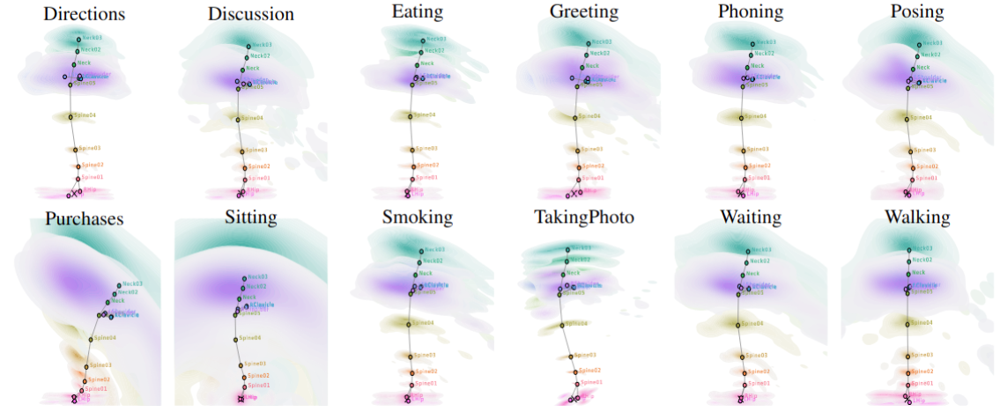

# SIMSPINE Dataset

**SIMSPINE** is a large-scale synthetic dataset built on top of [Human3.6M](http://vision.imar.ro/human3.6m/description.php), providing **3D human motion sequences with anatomically detailed spine annotations and biomechanical parameters**.  
It serves as a bridge between computer vision and musculoskeletal modeling, supporting applications in human motion analysis, biomechanics, and medical imaging.



---

## Overview

Each sequence in the SIMSPINE dataset provides:
- **37 anatomical landmarks** covering the entire human body, including an anatomically accurate spine (C1–L5) and pelvis landmarks.
- **54 biomechanical parameters** compatible with the [Rajagopal et al.](https://simtk.org/projects/full_body) full-body musculoskeletal model for OpenSim.
- **Scaled OpenSim models** per Human3.6M subject, ensuring subject-specific anthropometric fidelity.
- **Frame-aligned data** for all Human3.6M sequences with both **ground-truth (GT)** and **predicted** 3D poses.

### Key Statistics

| Item | Value |
|---|---|
| Total frames | 2.14M |
| Train / test split | 1.56M train, 0.58M test |
| Subjects / actions | 7 subjects, 15 actions |
| Train subjects | S1, S5, S6, S7, S8 |
| Test subjects | S9, S11 |
| Spine-centric landmarks | 15 total: 9 vertebral-column points, 2 skull points, 2 clavicle points, 2 shoulder-blade points |
| Marker set | 37 markers total: 12 Human3.6M limb points, 15 new spine points, 10 pseudo-labels on feet and face |
| Kinematic outputs | 62 axes, including 56 Euler angles |
| Labels | 3D vertebral positions and per-segment rotational kinematics |

---

## Directory Structure

You need to request access by contacting the authors. Once you have access, download and extract the dataset in `data/simspine/` directory. Alternatively, the provided generation scripts can be used to create the dataset from scratch, assuming you have access to the Human3.6M dataset.

The resulting directory structure will be as follows:

```
<project_root>/
└── data/
    └── SIMSPINE/
        ├── cameras/
        │   ├── Calib_S1.toml
        │   ├── Calib_S5.toml
        │   └── ...
        ├── models/
        │   ├── S1.osim
        │   ├── S5.osim
        │   └── ...
        ├── positions/
        │   ├── S1/
        │   │   ├── S1_<ACTION_1>.trc
        │   │   └── ...
        │   ├── S5/
        │   │   ├── S5_<ACTION_1>.trc
        │   │   └── ...
        │   └── ...
        ├── kinematics/
        │   ├── S1/
        │   │   ├── S1_<ACTION_1>/
        │   │   │   ├── S1_<ACTION_1>.mot
        │   │   │   ├── _ik_marker_errors.sto
        │   │   │   └── _ik_model_marker_locations.sto
        │   │   └── ...
        │   ├── S5/
        │   │   ├── S5_<ACTION_1>/
        │   │   │   ├── S5_<ACTION_1>.mot
        │   │   │   ├── _ik_marker_errors.sto
        │   │   │   └── _ik_model_marker_locations.sto
        │   │   └── ...
        │   └── ...
        └── README.md
```

---
